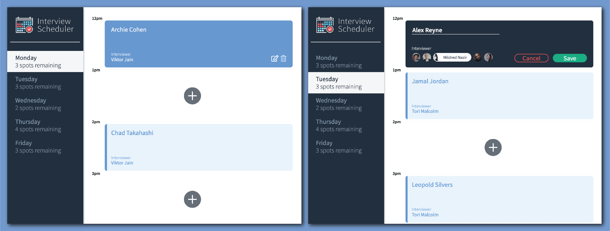

# Interview Scheduler
Interview Scheduler is a React app that uses custom hooks and selector functions to allow users to create, edit, and cancel interviews.

- Development focused on a single page application (SPA) called Interview Scheduler, built using React.
- Data is persisted by the API server using a PostgreSQL database.
- The client application communicates with an API server over HTTP, using the JSON format.
- Jest, Storybook, and Cypress tests are used through the development of the project.

---
## v Screen Shots v



---

## Stack
```sh
- jsx
- React
- Javascript
- Babel
- Jest
- Cypress
- Storybook
- Axios
- Webpack
- Webpack Dev Server
```

---
## Setup

Install dependencies with `npm install`.

## Running Webpack Development Server

```sh
npm start
```

## Running Jest Test Framework

```sh
npm test
```

## Running Storybook Visual Testbed

```sh
npm run storybook
```
---
## Dependencies

```sh
- axios | ^0.24.0
- classnames | ^2.2.6
- cors | ^2.8.5
- cypress | ^9.1.1
- normalize.css | ^8.0.1
- react | ^16.14.0
- react-dom | ^16.9.0
- react-scripts | 3.0.0
```
---